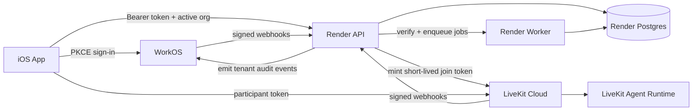
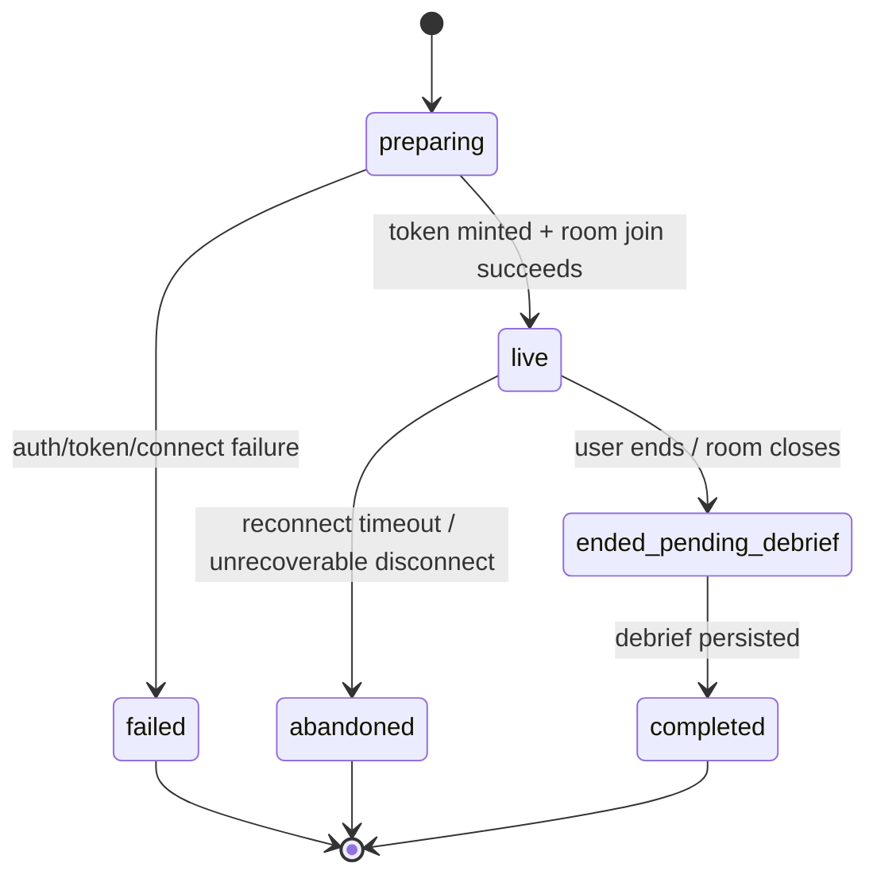

# feat: Build production backend foundation with Render, Postgres, WorkOS, and LiveKit

## Overview

Build the production control plane around the existing Couch realtime stack by introducing a Render-hosted API + worker topology, a relational Postgres data model for durable session history, WorkOS-based authentication and organization context, and a hardened LiveKit token/session lifecycle. The plan keeps LiveKit Cloud as the realtime plane, preserves the existing `ConversationDriver` seam and feature-flagged fallback behavior, and moves Couch from a local-only prototype to an authenticated, org-aware, audit-ready foundation for new cloud-backed sessions. In v1, audit readiness means tenant-scoped audit trails plus durable server records for authenticated sessions; it does not yet mean forensic-grade server-authoritative transcript provenance.

## Problem Frame

The repo already contains the right skeleton for realtime therapy-roleplay sessions: an iOS SwiftUI app, a Node/Fastify backend that mints LiveKit tokens, and a LiveKit agent path with optional LemonSlice avatars. What is missing is the production foundation around that core: user accounts, organization scoping, durable server-side session history, deployment topology, and a trustworthy authorization model. Today the app is explicitly local-first and account-less, with `SwiftData` as the sole history store and a device-held shared secret guarding token minting. That works for prototyping but does not satisfy the future direction of institution readiness, auditable tenant operations, or multi-device session history.

### Current gaps

- Couch currently treats one device as one user and stores session history only in local `SwiftData`. `AppRoot` gates solely on onboarding state and never on authentication or organization context. (See current root routing and local-only model in `Couch/App/AppRoot.swift` and `Couch/Models/UserProfile.swift`.)
- The backend already provides `POST /v1/sessions/token` and a LiveKit agent runtime, but it does not own durable app-session records, user identity, or org-aware authorization. (See `backend/src/token-server.ts` and `backend/src/agent.ts`.)
- Session history, debriefs, and streaks are all derived locally from `Session`, `Turn`, `Debrief`, and `StreakEvent`. There is no server source of truth, migration path, or multi-device sync story. (See `Couch/Models/Session.swift`, `Couch/Persistence/TranscriptStore.swift`, `Couch/Features/Home/HomeView.swift`, and `Couch/Features/History/HistoryView.swift`.)
- The current security boundary relies on a static `COUCH_BACKEND_SHARED_SECRET` held on the device. That must be replaced by authenticated user/org context before production rollout.
- The current debrief pipeline is generated on-device and persisted locally. That is acceptable for the current prototype, but it means the cloud history plan must clearly distinguish what is authoritative server data in v1 and what remains client-produced.

## Requirements Trace

### Platform & deployment

- R1. Introduce a production deployment topology on Render for Couch backend services without moving realtime media or agents off LiveKit.
- R8. Produce deployment, configuration, CI, and documentation updates sufficient for the stack to be operated by humans after implementation.

### Auth & tenancy

- R2. Replace the current shared-secret token-mint flow with WorkOS-backed authentication and organization-aware authorization.
- R5. Support institution-ready tenancy with WorkOS organizations, request-scoped active-organization context, and tenant-safe history reads/writes.

### Data & session lifecycle

- R3. Add a normal relational database as the durable source of truth for users, organizations, session history, finalized transcript turns, and debrief artifacts for new authenticated sessions.
- R4. Preserve the existing session UX seam (`ConversationDriver`, LiveKit transport, fallback ladder) while making the backend authoritative for app-session lifecycle.

### Audit & rollout

- R6. Introduce durable auditability for meaningful backend actions and org-scoped security events, with explicit trust-boundary documentation for what is and is not authoritative in v1.
- R7. Keep rollout incremental and reversible for new traffic by preserving feature flags, avoiding a flag day cutover from local-only history, and documenting which created cloud records are forward-only.

## Scope Boundaries

- Do not replace LiveKit Cloud with self-hosted media infrastructure.
- Do not remove the legacy `ElevenLabsConversationDriver` fallback in the first rollout.
- Do not implement billing, seat management, or institution-facing admin UX beyond the minimum auth/org plumbing required for the new backend.
- Do not import existing device-local session history into the cloud in v1; existing local history remains device-only unless a later migration task explicitly adds import.
- Do not move debrief generation itself to the backend in v1; client-generated debrief artifacts may be uploaded and stored server-side, but backend-generated debriefs are a separate task.
- Do not introduce support/admin cross-org access tooling or impersonation in this foundation pass.
- Do not redesign the therapy-session product behavior itself; this plan focuses on backend, auth, durable history, and deployment foundations.

### Deferred to Separate Tasks

- Historical import of old local `SwiftData` sessions into the server store.
- Advanced institution reporting, analytics exports, and LMS/integration surfaces.
- A future move of transcript capture from client-sent finalized turns to a fully agent-side authoritative event stream if stricter audit requirements emerge.
- Backend-generated debrief creation and retry orchestration.
- A broader replay/event-sourcing architecture if provider-authoritative event ingestion becomes necessary.

## Context & Research

### Relevant Code and Patterns

- `Couch/Features/Session/SessionCoordinator.swift` already abstracts realtime transport via `ConversationDriver`, creates a local session record before connect, and owns the visible session state machine. The production plan should preserve this seam and extend it with backend-owned session IDs rather than collapsing the driver abstraction.
- `Couch/Services/Session/LiveKitTokenClient.swift` is the existing typed HTTP seam for backend token issuance. It should evolve into an authenticated session-control client rather than being replaced by view-layer requests.
- `Couch/Services/SecretsProvider.swift`, `Couch/Services/KeychainService.swift`, and `Couch/Services/AppFeatureFlags.swift` establish the current typed config/secret and rollout patterns. New auth and backend-history config should mirror these conventions.
- `backend/src/token-server.ts`, `backend/src/agent.ts`, `backend/src/config/env.ts`, and `backend/Dockerfile` already imply a split runtime of public HTTP service plus separate agent process. That is the natural starting point for Render web-service + worker/service deployment.
- `backend/src/config/scenarios.ts` is already backend-authoritative for runtime scenario behavior. This is a useful precedent for moving more session policy to the server.
- `Couch/Models/Session.swift`, `Couch/Models/Turn.swift`, `Couch/Models/Debrief.swift`, `Couch/Persistence/TranscriptStore.swift`, `Couch/Features/Home/HomeView.swift`, and `Couch/Features/History/HistoryView.swift` define the existing session-history shape that the relational model should initially mirror to minimize UI churn.
- `CouchTests/LiveKitTokenClientTests.swift`, `CouchTests/ConversationDriverTests.swift`, `CouchTests/ModelContainerTests.swift`, `CouchTests/ScenarioCatalogTests.swift`, and `backend/test/scenarios.test.ts` are the strongest current seam tests and should be extended rather than bypassed.

### Institutional Learnings

- No direct prior learnings exist in-repo for Render, WorkOS, or relational backend architecture beyond the current LiveKit avatar architecture document.
- `docs/avatar-architecture.md` is still the most relevant architectural precedent: it documents the split between token server, agent process, backend-owned provider secrets, and client-side fallback behavior.

### External References

- Render service topology and managed Postgres docs confirm the intended split between public web services, private/internal networking, background workers, and managed Postgres operations.
- WorkOS AuthKit docs confirm public-client PKCE patterns, organization-based tenancy, org switching semantics, and audit log capabilities.
- LiveKit docs confirm that production should use a protected token endpoint, that LiveKit Cloud is the correct managed realtime plane, and that agent runtimes should remain independently deployable.

## Key Technical Decisions

- **Use Render web service + worker + managed Postgres as the control plane.** Couch already has a container-ready Fastify backend and a separate LiveKit agent process. Render fits the API/control-plane and async-worker roles cleanly, while managed Postgres provides the durable relational store without introducing another backend paradigm.
- **Keep LiveKit Cloud as the realtime plane.** The backend should remain responsible for app-session policy, token minting, and persistence, but the iOS app should still connect directly to LiveKit using short-lived participant tokens. This preserves the current transport model and avoids tunneling media through the API.
- **Adopt WorkOS AuthKit with native/public-client PKCE for iOS using a loopback redirect flow.** WorkOS should own user identity and organization membership. The app should authenticate directly via PKCE, store tokens securely, and send bearer tokens to the Couch API. In v1, `WorkOSAuthCoordinator` owns a loopback `127.0.0.1` callback flow plus launch-time refresh; the backend only validates access tokens and never stores mobile refresh tokens.
- **Make the backend authoritative for app-session identity.** Replace the implicit local-only session start with a backend-owned `app_session_id` created before or as part of token issuance. The token response should include the durable session ID so every later turn, debrief, and history fetch can be correlated reliably.
- **Model session state and debrief state separately.** The durable app-session lifecycle should include at least `preparing`, `live`, `ended_pending_debrief`, `completed`, `abandoned`, and `failed`, while debrief upload/status should be tracked separately as `pending`, `uploaded`, or `failed_retryable`. `failed` is for unrecoverable session setup/runtime failure, not for a retryable missing debrief artifact.
- **Use WorkOS organization IDs as the external tenant identity, but keep product authorization and ownership in Postgres.** WorkOS is the identity and org system of record; Postgres remains the product system of record for sessions, turns, debriefs, and app-specific preferences. In v1, org-owned history remains visible only to current org members; no support/admin cross-org access is added in this plan.
- **Treat active organization as request-scoped, with sticky selection only as a UX convenience.** The client may remember the last selected org locally, but every authenticated API request must send an active-org hint and the backend must re-resolve it against verified identity plus local membership records before any read/write/token-mint action.
- **Use canonical relational tables plus minimal idempotency and queue tables in v1.** Durable history should be stored in normalized tables for sessions, finalized transcript segments, debrief artifacts, membership mirrors, webhook receipts, and queued jobs. Do not introduce a broader replay/event-sourcing architecture in the foundation pass.
- **Receive all provider webhooks through the public API, then hand off asynchronously via a Postgres-backed job queue.** The API verifies signatures/timestamps, preserves raw payloads where needed, records idempotent webhook receipts, and enqueues jobs transactionally. The Render worker polls the queue and performs retryable sync/reconciliation work. No separate Redis/queue service is introduced in v1.
- **Use provider events selectively.** WorkOS events are authoritative for mirroring WorkOS organization/membership state, while LiveKit webhooks are advisory safety nets for abandonment and room-close reconciliation. Client-authenticated writes remain authoritative for happy-path session start/end, finalized turn uploads, and debrief artifact uploads in v1.
- **Bind LiveKit join tokens tightly to one authenticated session scope.** Token minting and reminting must bind a token to one `app_session_id`, one user, one org, one room, and the minimum participant grants required for that flow. Remint is allowed only for the same live session inside a backend-enforced recovery window.
- **Keep existing device-local history device-only in v1.** During migration, authenticated cloud history becomes the source of truth for signed-in users, while old local records remain on device and are not silently merged into the cloud.
- **Use a hard UX boundary between cloud history and legacy device-only history.** In v1, authenticated Home and History primary stats/lists are driven only by cloud-backed sessions created after rollout. Pre-existing device-only history remains accessible only through a clearly labeled device-only surface and does not contribute to cloud streaks or stats.
- **Keep freeze-help/system coaching turns client-only in v1.** The repo explicitly marks those turns as local prompts that are never sent back to the agent. They should stay out of the durable server transcript unless product requirements change.
- **Keep onboarding and `UserProfile` device-local in v1.** Authentication becomes the outer app gate, but existing onboarding/profile data is not yet moved to the backend or made org-scoped in this foundation pass.
- **Emit WorkOS audit log events from backend write paths, not clients.** Use WorkOS Audit Logs for tenant-facing audit trails around sign-in/org context changes, token-mint/session start/end, debrief artifact upload completion, destructive actions, authorization failures, and operator replay/remediation actions. Never send raw transcript text to WorkOS audit logs.
- **Be explicit about rollback limits.** Feature flags are reversible for new traffic and feature exposure, but cloud-created session records are forward-only. The operator docs must include a rollback matrix that states which toggles only stop new cloud writes versus which ones restore legacy local-only behavior.

## Open Questions

### Resolved During Planning

- **Relational database choice:** Use Postgres as the default relational store for v1. This best matches the reporting/query shape implied by the current `Session`/`Turn`/`Debrief` model and keeps the stack boring on purpose.
- **Render topology:** Use one public API web service, one background worker, and managed Postgres in the same region. Keep LiveKit agents separate from the main API process.
- **Active organization behavior:** If a user has multiple WorkOS org memberships, show an org picker after auth when no sticky selection exists. Persist the last active org locally as a UX hint only; the backend must re-resolve the requested org on every authenticated request and fail closed if membership is missing or stale.
- **History migration stance:** Existing device-local history is not imported in v1; cloud-backed history begins with authenticated sessions created after rollout.
- **History UX boundary:** Authenticated Home/History primary surfaces show only cloud-backed sessions created after rollout. Device-only history stays separate and clearly labeled.
- **Session-creation point:** Create a durable backend session row before returning a LiveKit join token, and include the backend-owned `app_session_id` in the same response.
- **Local/cloud session bridge:** The app continues creating a provisional local `Session` record for immediate UI state, then patches that record with `cloudSessionID` and cloud lifecycle state after session-control succeeds. Failed token minting marks the local draft as failed/abandoned rather than leaving an ambiguous pending record.
- **Onboarding/profile stance:** Existing onboarding and `UserProfile` remain device-local inside the authenticated shell in v1. No server-backed user-profile migration is included in this foundation plan.
- **Sign-out / org switch safety:** Block org switching during a live session or pending debrief flow; require the current session flow to resolve before context changes complete. Revoked membership removes future read/write/remint eligibility even if a stale local sticky org still exists.

### Deferred to Implementation

- **Exact query/migration tooling:** Choose the specific Postgres client/migration library during implementation, but keep the architecture SQL-first and lightweight. The plan assumes typed repositories and explicit migrations regardless of library.
- **Transcript retention windows and archival strategy:** Exact retention and export policy should be finalized with product/privacy requirements in implementation.
- **Future authoritative transcript ingestion:** Whether to later ingest transcripts directly from the agent or LiveKit server-side events instead of relying on client-submitted finalized turns is intentionally deferred beyond the first delivery.

## Output Structure

    docs/plans/
      2026-04-19-001-feat-render-workos-livekit-foundation-plan.md
    backend/
      render.yaml
      migrations/
        001_initial_auth_and_history.sql
      src/
        auth/
          workos.ts
          token-verifier.ts
        db/
          client.ts
          repositories/
            jobs.ts
            organizations.ts
            users.ts
            sessions.ts
            transcript_segments.ts
            debriefs.ts
        routes/
          auth.ts
          sessions.ts
          history.ts
          debriefs.ts
          webhooks/
            workos.ts
            livekit.ts
        workers/
          job_runner.ts
          session_reconciliation.ts
          workos_event_sync.ts
      test/
        auth.workos.test.ts
        sessions.route.test.ts
        history.repository.test.ts
        webhook.workos.test.ts
    Couch/
      Features/
        Auth/
          AuthGateView.swift
          OrganizationPickerView.swift
      Services/
        Auth/
          WorkOSAuthCoordinator.swift
          AuthSessionStore.swift
          LoopbackAuthCallbackServer.swift
        History/
          SessionHistoryAPIClient.swift
          SessionHistorySyncCoordinator.swift
    CouchTests/
      AuthSessionStoreTests.swift
      SessionHistorySyncTests.swift
      SessionCloudMappingTests.swift
      LiveKitTokenClientTests.swift
      AppRootAuthRoutingTests.swift
    .github/workflows/
      backend-ci.yml

## High-Level Technical Design

> *This illustrates the intended approach and is directional guidance for review, not implementation specification. The implementing agent should treat it as context, not code to reproduce.*

### Session lifecycle

## Implementation Units

- [ ] **Unit 1: Establish Render and Postgres control-plane foundation**

**Goal:** Create the deployable backend skeleton for Render-hosted API, worker, and managed Postgres so later auth/history work has a stable runtime target.

**Requirements:** R1, R3, R8

**Dependencies:** None

**Files:**
- Create: `backend/render.yaml`
- Create: `backend/src/db/client.ts`
- Create: `backend/src/db/repositories/jobs.ts`
- Create: `backend/migrations/001_initial_auth_and_history.sql`
- Modify: `backend/src/config/env.ts`
- Modify: `backend/.env.example`
- Modify: `backend/Dockerfile`
- Create: `backend/test/bootstrap.test.ts`

**Approach:**
- Introduce Render blueprint/service configuration that declares a public API service, a worker service, and a managed Postgres dependency.
- Extend backend env parsing to include Postgres connection settings, WorkOS config placeholders, webhook secrets, queue/worker settings, and rollout flags while preserving the current Zod validation pattern.
- Add the first migration and DB bootstrap/client layer without yet changing user-facing behavior.
- Add a minimal Postgres-backed job queue and webhook-receipt/idempotency tables so Render workers have a concrete discovery/retry model without adding Redis or another queue service in v1.
- Keep the current token server and agent runtime reachable, but restructure bootstrap code so HTTP routes and worker jobs can share the same config and DB layers.
- Define secret boundaries up front: Render environment groups / service env hold server-only secrets, while the iOS app stores only public-client WorkOS config plus user session tokens in Keychain.

**Execution note:** Start with failing backend bootstrap/config tests so environment validation and DB initialization behavior are pinned before auth/history work lands.

**Patterns to follow:**
- `backend/src/config/env.ts`
- `backend/Dockerfile`
- `backend/test/scenarios.test.ts`

**Test scenarios:**
- Happy path — backend boots successfully when required Render/Postgres env is present and migrations are available.
- Error path — backend fails fast with readable validation errors when required DB or WorkOS env is missing.
- Integration — migration bootstrap creates the expected core tables, queue tables, and webhook receipt tables on an empty database and is repeatable/idempotent for subsequent starts.
- Integration — worker bootstrap can discover and claim pending queue jobs from Postgres without requiring any extra broker process.

**Verification:**
- The backend can start in a configuration that includes Postgres and separates API vs worker roles without changing existing realtime behavior yet.

- [ ] **Unit 2: Introduce WorkOS auth, org context, and top-level app gating**

**Goal:** Add native WorkOS sign-in, secure token storage, active-organization resolution, and top-level app routing states that replace the current “one device = one user” assumption.

**Requirements:** R2, R5, R7, R8

**Dependencies:** Unit 1

**Files:**
- Modify: `Couch/App/CouchApp.swift`
- Create: `Couch/Features/Auth/AuthGateView.swift`
- Create: `Couch/Features/Auth/OrganizationPickerView.swift`
- Create: `Couch/Services/Auth/WorkOSAuthCoordinator.swift`
- Create: `Couch/Services/Auth/AuthSessionStore.swift`
- Create: `Couch/Services/Auth/LoopbackAuthCallbackServer.swift`
- Modify: `Couch/App/AppRoot.swift`
- Modify: `Couch/Services/SecretsProvider.swift`
- Modify: `Couch/Services/KeychainService.swift`
- Create: `CouchTests/AuthSessionStoreTests.swift`
- Create: `CouchTests/AppRootAuthRoutingTests.swift`
- Create: `backend/src/auth/workos.ts`
- Create: `backend/src/auth/token-verifier.ts`
- Create: `backend/src/routes/auth.ts`
- Create: `backend/test/auth.workos.test.ts`

**Approach:**
- Add a new outer app state machine: `signed_out`, `authenticating`, `organization_selection_required`, `ready`.
- Implement WorkOS PKCE flow in the iOS app using a loopback `127.0.0.1` callback listener owned by `WorkOSAuthCoordinator`, storing access/refresh material in Keychain-backed auth storage rather than in `Secrets.plist`.
- Add launch-time session restoration and refresh handling in the auth coordinator so relaunch does not depend on ad hoc view-state recovery.
- Add API-side bearer-token verification and request-scoped active-org resolution. Backend responses should return the current user, org memberships, and a validated active-org context, but client-provided sticky org state remains advisory only.
- Keep onboarding and `UserProfile` device-local inside the authenticated shell rather than as a pre-auth singleton flow; no server-backed profile migration is included in this unit.

**Patterns to follow:**
- `Couch/Services/SecretsProvider.swift`
- `Couch/Services/KeychainService.swift`
- `Couch/Services/Session/LiveKitTokenClient.swift`
- `Couch/App/AppRoot.swift`

**Test scenarios:**
- Happy path — a user with one WorkOS organization signs in and lands directly in the app shell with that org active.
- Happy path — a user with multiple organizations is prompted to select an org and then lands in the correct scope.
- Edge case — app relaunch with a stored valid session restores the sticky org and bypasses sign-in.
- Edge case — loopback callback completes the PKCE flow correctly and is rejected if the callback state/verifier pair does not match the initiated auth request.
- Error path — expired or invalid bearer token forces sign-out and clears local authenticated state without wiping all local device data.
- Error path — previously active org membership no longer exists; the app surfaces org selection instead of loading stale scoped data.
- Integration — API token verification rejects requests with mismatched issuer/audience and returns auth state the app can map into root routing.
- Integration — revoked membership or sign-out on another device removes future active-org access and forces a fresh org resolution on the next privileged request.

**Verification:**
- Authentication and org selection are first-class app states, and no authenticated API path relies on the legacy shared-secret model.

- [ ] **Unit 3: Create the durable relational model for users, orgs, sessions, turns, and debriefs**

**Goal:** Add the Postgres schema and repository boundaries required for tenant-aware history, including backend-owned session lifecycle, org-owned authorization state, and minimal idempotency/queue tables.

**Requirements:** R3, R5, R6, R7

**Dependencies:** Unit 1, Unit 2

**Files:**
- Modify: `backend/migrations/001_initial_auth_and_history.sql`
- Modify: `backend/src/db/repositories/jobs.ts`
- Create: `backend/src/db/repositories/organizations.ts`
- Create: `backend/src/db/repositories/users.ts`
- Create: `backend/src/db/repositories/sessions.ts`
- Create: `backend/src/db/repositories/transcript_segments.ts`
- Create: `backend/src/db/repositories/debriefs.ts`
- Create: `backend/test/history.repository.test.ts`

**Approach:**
- Mirror the current local data model into normalized relational tables keyed by backend-owned IDs, with WorkOS user/org IDs stored as external identifiers.
- Add `organizations`, `users`, `organization_memberships`, `app_sessions`, `transcript_segments`, `debrief_artifacts`, `webhook_receipts`, and `job_queue` tables required for app logic.
- Model session lifecycle explicitly (`preparing`, `live`, `ended_pending_debrief`, `completed`, `abandoned`, `failed`) instead of flattening everything into a single completed row.
- Track debrief upload separately from session state so retryable missing debriefs do not collapse into terminal session failure.
- Use current org membership as the v1 product-authorization rule for interactive access to org-owned history; historical sessions remain owned by the organization, not by the individual user once membership ends.
- Exclude local-only freeze-help/system coaching turns from the durable transcript in v1.

**Technical design:** *(directional guidance only)*
- Use the current `Session`, `Turn`, and `Debrief` SwiftData shape as the projection target so the app can cache or map server data without inventing a second semantic model.
- Use WorkOS organization IDs as external tenant keys, but always scope server queries by local membership records rather than trusting client-provided org IDs alone.

**Patterns to follow:**
- `Couch/Models/Session.swift`
- `Couch/Models/Turn.swift`
- `Couch/Models/Debrief.swift`
- `Couch/Persistence/TranscriptStore.swift`

**Test scenarios:**
- Happy path — creating a backend user/org mapping from verified WorkOS context creates or reuses local records without duplicates.
- Happy path — creating an app session inserts a `preparing` session row plus the queue/idempotency metadata needed for later webhook/job processing.
- Edge case — the same transcript segment is submitted twice with the same external ID and is stored once.
- Edge case — session ends before debrief exists; history model still stores a durable ended session in `ended_pending_debrief`.
- Error path — cross-org access attempts to a session ID are rejected even when the user is otherwise authenticated.
- Error path — a user removed from an organization loses interactive read/remint access to that org’s sessions on the next privileged request.
- Integration — repository methods can reconstruct a session summary (metadata, finalized turn count, debrief state) from normalized rows without relying on client-local models.

**Verification:**
- The backend can represent tenant-aware session history and debrief states without losing idempotency or forcing UI layers to understand raw provider events.

- [ ] **Unit 4: Replace shared-secret token minting with authenticated session control**

**Goal:** Turn session start into an authenticated app-session control flow that creates a backend session record, mints LiveKit tokens, and preserves the current client transport seam.

**Requirements:** R1, R2, R4, R5, R7

**Dependencies:** Unit 2, Unit 3

**Files:**
- Modify: `backend/src/token-server.ts`
- Create: `backend/src/routes/sessions.ts`
- Create: `backend/src/livekit/token_service.ts`
- Modify: `Couch/Models/Session.swift`
- Modify: `Couch/Services/Session/LiveKitTokenClient.swift`
- Modify: `Couch/Features/Session/SessionCoordinator.swift`
- Create: `CouchTests/SessionCloudMappingTests.swift`
- Modify: `CouchTests/LiveKitTokenClientTests.swift`
- Create: `backend/test/sessions.route.test.ts`

**Approach:**
- Evolve the current token endpoint into an authenticated session-control endpoint that:
  1. validates the current user and active org,
  2. creates or reuses a backend `app_session_id`,
  3. mints a short-lived LiveKit participant token,
  4. returns both the token payload and durable session identifiers/state hints.
- Preserve the existing typed `LiveKitTokenClient` seam and the app’s transport fallback logic, but remove reliance on `X-Couch-Auth` for production clients.
- Keep token mint and app-session creation in one request/response to avoid unnecessary mobile round trips while still making the backend authoritative.
- Carry sticky participant identity from authenticated user/org context rather than from per-install `UserDefaults`.
- Keep the existing provisional local `Session` creation for immediate UI state, but add a `cloudSessionID` / cloud lifecycle mapping on the local model so `SessionCoordinator` can patch the draft record after session-control succeeds.
- Treat client-provided active-org and reconnect intent as advisory only; the backend must re-resolve membership and enforce that remint is for the same live `app_session_id`, room, user, and org within the configured recovery window.
- Keep refresh-token handling client-side only. The API validates access tokens on every privileged request and fails closed when membership or org context can no longer be validated.

**Execution note:** Extend existing token-client tests first so the request/response contract is pinned before changing `SessionCoordinator` and route behavior.

**Patterns to follow:**
- `Couch/Services/Session/LiveKitTokenClient.swift`
- `Couch/Features/Session/SessionCoordinator.swift`
- `backend/src/token-server.ts`
- `CouchTests/LiveKitTokenClientTests.swift`

**Test scenarios:**
- Happy path — authenticated user starts a session and receives `app_session_id`, `serverUrl`, `participantToken`, and avatar/session metadata in one response.
- Edge case — repeated start request for the same pending session returns the same durable session rather than creating duplicates.
- Edge case — provisional local session record is patched with `cloudSessionID` after session-control succeeds and is marked failed/abandoned when token mint fails.
- Error path — user authenticated but not a member of the active org cannot mint a token for that org.
- Error path — WorkOS-authenticated request without a valid active-org context is rejected with a resolvable client error.
- Error path — remint request for a different org, room, or stale session state is rejected even when the caller is otherwise authenticated.
- Integration — `SessionCoordinator` stores the backend session identity and still falls back to the legacy transport only when LiveKit/backend capability is unavailable by feature flag.
- Integration — reconnect/remint flow can issue a fresh participant token for the same live app session within the allowed recovery window.

**Verification:**
- Session start is now an authenticated, org-aware backend operation that still fits the existing iOS transport abstraction.

- [ ] **Unit 5: Persist finalized turns and debrief artifacts, and reconcile provider signals on the backend**

**Goal:** Make Postgres the source of truth for authenticated session history and debrief artifacts for new sessions, with explicit webhook ingress and a concrete Postgres-backed worker/retry model.

**Requirements:** R3, R4, R5, R7, R8

**Dependencies:** Unit 3, Unit 4

**Files:**
- Create: `backend/src/routes/history.ts`
- Create: `backend/src/routes/debriefs.ts`
- Create: `backend/src/routes/webhooks/workos.ts`
- Create: `backend/src/routes/webhooks/livekit.ts`
- Create: `backend/src/workers/job_runner.ts`
- Create: `backend/src/workers/session_reconciliation.ts`
- Create: `backend/src/workers/workos_event_sync.ts`
- Modify: `Couch/Features/Debrief/DebriefCoordinator.swift`
- Create: `backend/test/webhook.workos.test.ts`
- Create: `backend/test/webhook.livekit.test.ts`

**Approach:**
- Persist finalized user/agent turns to the backend under the authenticated `app_session_id`, using stable external turn IDs for idempotency.
- Upload client-generated debrief artifacts to the backend after local generation succeeds; the backend stores those artifacts durably but does not generate them itself in v1.
- Receive WorkOS and LiveKit webhooks at API routes only; verify signatures/timestamps, preserve raw payloads where required, record idempotent webhook receipts, enqueue jobs transactionally, and return quickly.
- Use the Render worker to poll the Postgres-backed job queue for membership-sync and session-reconciliation work. WorkOS events are authoritative for membership mirror updates, while LiveKit events are advisory safety nets for abandonment and room-close reconciliation.
- Represent sessions without finished debrief uploads explicitly as `ended_pending_debrief`, and keep `debrief_status = failed_retryable` distinct from terminal session failure.

**Patterns to follow:**
- `Couch/Persistence/TranscriptStore.swift`
- `Couch/Features/Debrief/DebriefCoordinator.swift`
- `Couch/Features/Home/HomeView.swift`
- `Couch/Features/History/HistoryView.swift`

**Test scenarios:**
- Happy path — completed authenticated session uploads finalized turns and a client-generated debrief artifact, and the backend stores both under the same `app_session_id`.
- Happy path — WorkOS webhook receipt is verified, stored once, and results in exactly one membership-sync job.
- Happy path — LiveKit room-close webhook for a still-live session enqueues a reconciliation job that safely marks the session abandoned or ended based on current durable state.
- Edge case — app backgrounds or disconnects after some turns were persisted; reconciliation marks the session correctly without duplicating turns.
- Error path — debrief artifact upload fails after local generation; session remains durable in `ended_pending_debrief` with a retryable debrief status.
- Error path — duplicate WorkOS or LiveKit webhook delivery is idempotent and does not double-create sessions, turns, queue jobs, or audit events.
- Error path — webhook with bad signature/timestamp is rejected and logged without mutating org/session state.

**Verification:**
- The backend owns durable session history, debrief artifact storage, and provider-signal reconciliation for new authenticated sessions without introducing a second queueing platform.

- [ ] **Unit 6: Surface cloud history in the app with an explicit local/cloud boundary**

**Goal:** Let authenticated users see cloud-backed history and stats for new sessions while preserving clear separation from legacy device-only records.

**Requirements:** R3, R4, R5, R7, R8

**Dependencies:** Unit 4, Unit 5

**Files:**
- Create: `Couch/Services/History/SessionHistoryAPIClient.swift`
- Create: `Couch/Services/History/SessionHistorySyncCoordinator.swift`
- Modify: `Couch/Features/Home/HomeView.swift`
- Modify: `Couch/Features/History/HistoryView.swift`
- Create: `CouchTests/SessionHistorySyncTests.swift`

**Approach:**
- Introduce a sync/cache layer in the app so Home and History can be driven by server-backed summaries for authenticated sessions while preserving responsive local rendering.
- Make cloud-backed history the only source for authenticated primary stats, lists, and streaks for new sessions created after rollout.
- Keep pre-existing device-local history separate from cloud history in v1 through a clearly labeled device-only surface; do not silently merge counts or streaks across both sources.
- Ensure sessions in `ended_pending_debrief` or `debrief_status = failed_retryable` remain visible in authenticated history with explicit UI copy rather than disappearing.

**Patterns to follow:**
- `Couch/Features/Home/HomeView.swift`
- `Couch/Features/History/HistoryView.swift`
- `Couch/Persistence/TranscriptStore.swift`

**Test scenarios:**
- Happy path — authenticated user sees cloud-backed reps, duration, confidence trend, and session rows for new sessions after sync completes.
- Happy path — a session in `ended_pending_debrief` stays visible with an explicit pending indicator until the debrief artifact upload succeeds.
- Edge case — authenticated user with existing device-only history sees cloud history as the primary source and a separate labeled device-only history surface for old local sessions.
- Edge case — app relaunch on a second device loads cloud-backed history without depending on the original device’s local store.
- Error path — history sync fails temporarily; cached cloud summaries remain visible and device-only history is not accidentally merged into cloud metrics.
- Integration — Home and History maintain behavioral parity with the current local stat calculations for cloud-backed sessions while preserving the explicit local/cloud boundary.

**Verification:**
- Authenticated users can close the app, reopen it on the same or another device, and still see durable cloud-backed history for new sessions without ambiguous mixing of legacy device-only data.

- [ ] **Unit 7: Add auditability, rollout controls, CI, and operator documentation**

**Goal:** Finish the production foundation with audit emission, deployment/config docs, backend CI, and reversible rollout controls.

**Requirements:** R6, R7, R8

**Dependencies:** Units 1-6

**Files:**
- Create: `.github/workflows/backend-ci.yml`
- Create: `backend/README.md`
- Modify: `README.md`
- Modify: `Couch/Services/AppFeatureFlags.swift`
- Modify: `Couch/Secrets.plist.example`
- Modify: `backend/.env.example`
- Create: `backend/src/audit/workos_audit.ts`
- Create: `backend/test/audit_events.test.ts`

**Approach:**
- Introduce feature flags for auth rollout and server-backed history rollout so the stack can be enabled progressively by cohort/environment.
- Emit WorkOS audit events for sign-in completion, active-org changes, authorization failures, token/session start/end, debrief artifact upload completion, webhook signature failures, destructive data actions, and operator replay/remediation actions from backend write paths.
- Add backend CI for typechecking and targeted tests so the repo stops treating the backend as an unverified sidecar.
- Write the missing backend documentation, Render deployment notes, required env matrix, WorkOS callback setup, secret boundaries, webhook verification rules, request-scoped active-org rules, and LiveKit operational notes.
- Document a rollback matrix that distinguishes reversible feature exposure for new traffic from forward-only cloud records already created under the new path.
- Keep raw transcript/debrief text out of WorkOS audit payloads and application logs; document minimum audit metadata and log-redaction expectations.
- Preserve the legacy fallback transport until authenticated server-backed sessions have been validated end-to-end.

**Patterns to follow:**
- `Couch/Services/AppFeatureFlags.swift`
- `.github/workflows/ios-ci.yml`
- `README.md`

**Test scenarios:**
- Happy path — feature flags disabled leaves the current legacy transport and local-only history behavior intact.
- Happy path — audit event emitter writes idempotent tenant-scoped events for the targeted backend actions.
- Edge case — partial rollout environment missing one optional feature flag defaults safely rather than partially enabling a broken path.
- Error path — audit-log emission failure does not corrupt the primary session write path, but records enough operational signal for retry/alerting.
- Error path — webhook signature failure or operator replay action is itself captured as an auditable security/operational event without exposing transcript contents.
- Integration — backend CI runs the new backend tests and prevents regressions in env validation, auth verification, and history persistence.

**Verification:**
- The new backend/auth/history stack can be deployed, rolled back, and operated with explicit docs, CI, and rollout controls instead of tribal knowledge.

## System-Wide Impact

- **Interaction graph:** `AppRoot` routing, auth/session storage, session-control API, LiveKit token minting, debrief artifact upload, webhook ingress, worker reconciliation, and history/stat surfaces will all change. This is a cross-cutting feature, not a backend-only patch.
- **Error propagation:** auth failures should surface at the root shell level; session-control failures should resolve into retriable session errors; worker/webhook failures should not invalidate already-durable session rows.
- **State lifecycle risks:** duplicate session creation on retries, transcript duplication, org-context leakage, reconnect ambiguity, and “ended but no debrief yet” states are the main lifecycle hazards to design around.
- **API surface parity:** any new authenticated session-control API must remain compatible with the current `LiveKitTokenClient` and future web/admin consumers, not just this iOS app.
- **Integration coverage:** auth/org selection, session start/end, reconnects, debrief upload retries, webhook verification, and history sync each cross app/backend/provider boundaries and need integration-level validation.
- **Unchanged invariants:** LiveKit remains the realtime media plane; the `ConversationDriver` seam remains the client transport abstraction; local-only freeze-help prompts remain client-local in v1; the legacy fallback transport remains available until rollout is complete.

## Risks & Dependencies

| Risk | Mitigation |
|------|------------|
| Auth rollout locks existing users out of the app shell | Keep auth behind a rollout flag, add explicit root routing tests, and preserve local-only mode until WorkOS path is validated. |
| Cross-org data leakage through incorrect tenant scoping | Always derive effective org context from verified WorkOS-backed membership records and test negative cross-org history/session cases. |
| Duplicate sessions or turns during retries/reconnects | Use backend-owned session IDs, immutable event records, stable external turn IDs, and idempotent webhook handling. |
| Missing or failed debrief artifact upload introduces false “missing session” perception | Model `ended_pending_debrief` and retryable debrief status explicitly and surface them in Home/History rather than hiding unfinished records. |
| Local/cloud history divergence confuses users during migration | Keep old local history device-only in v1 and clearly define the cloud-history source of truth for authenticated sessions. |
| Backend sidecar remains undocumented and untested | Add backend CI, a missing `backend/README.md`, env docs, and Render deployment docs as part of the same delivery. |
| LiveKit/WorkOS provider outages or bad webhooks corrupt primary writes | Make client-authenticated writes authoritative for happy-path session data, route provider signals through verified webhook ingress plus queued reconciliation, and fail closed on unverifiable events. |

## Documentation / Operational Notes

- Add a dedicated `backend/README.md` with local dev, Render deployment topology, env matrix, and service responsibilities.
- Update `README.md` to stop describing the app as purely local-only once the new stack is enabled, and clearly document rollout flags plus supported deployment modes.
- Document WorkOS loopback redirect setup, access-token validation assumptions, webhook secrets, org-selection rules, and audit-log event categories.
- Document Render service responsibilities, region alignment, health checks, and Postgres backup/recovery expectations.
- Add a lightweight runbook for orphaned sessions, replaying failed webhook events, debrief upload retry behavior, and the operator-only boundaries for those actions.

## Sources & References

- Related code: `docs/avatar-architecture.md`
- Related code: `backend/src/token-server.ts`
- Related code: `backend/src/agent.ts`
- Related code: `Couch/Features/Session/SessionCoordinator.swift`
- Related code: `Couch/Services/Session/LiveKitTokenClient.swift`
- Related code: `Couch/Models/Session.swift`
- Related code: `Couch/Persistence/TranscriptStore.swift`
- External docs: Render web services, private networking, workers, and managed Postgres documentation
- External docs: WorkOS AuthKit PKCE, organizations, org switching, and audit logs documentation
- External docs: LiveKit Cloud, agent lifecycle, and production token endpoint documentation
